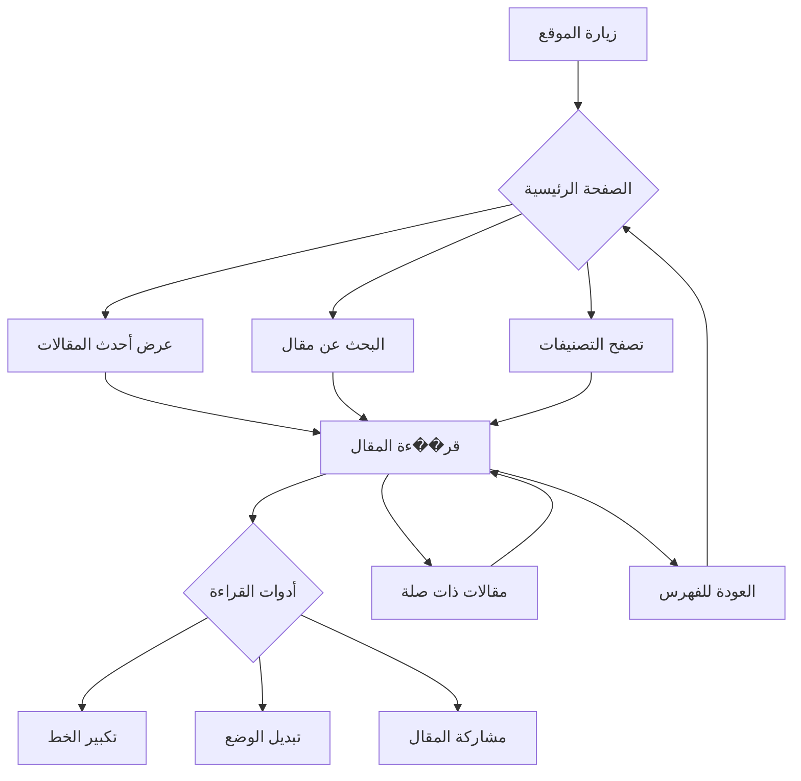

# 🎨 دليل التصميم التفصيلي

## 📐 الهيكل العام للصفحة

### الصفحة الرئيسية
```
┌─────────────────────────────────────────┐
│  Header (شريط التنقل)                    │
│  ┌─────────────────────────────────┐    │
│  │ Logo    |  Home  Articles  About│    │
│  └─────────────────────────────────┘    │
├─────────────────────────────────────────┤
│  Hero Section (قسم الترحيب)              │
│  ┌─────────────────────────────────┐    │
│  │                                 │    │
│  │    مرحباً بك في مدونتي          │    │
│  │    اقرأ، تأمل، تعلم            │    │
│  │                                 │    │
│  └─────────────────────────────────┘    │
├─────────────────────────────────────────┤
│  Stats Section (إحصائيات)                │
│  ┌─────┐ ┌─────┐ ┌─────┐               │
│  │ 12  │ │ 5   │ │ 3   │               │
│  │مقال │ │تصنيف│ │شهر  │               │
│  └─────┘ └─────┘ └─────┘               │
├─────────────────────────────────────────┤
│  Latest Articles (أحدث المقالات)         │
│  ┌─────────────────────────────────┐    │
│  │ 📝 عنوان المقال الأول           │    │
│  │    مقتطف من المقال...           │    │
│  │    ⏱️ 5 دقائق | 📅 2024-01-15  │    │
│  └─────────────────────────────────┘    │
│  ┌─────────────────────────────────┐    │
│  │ 📝 عنوان المقال الثاني          │    │
│  │    مقتطف من المقال...           │    │
│  │    ⏱️ 8 دقائق | 📅 2024-01-10  │    │
│  └─────────────────────────────────┘    │
├─────────────────────────────────────────┤
│  Footer (تذييل الصفحة)                   │
│  ┌─────────────────────────────────┐    │
│  │ © 2024 مدونتي | جميع الحقوق    │    │
│  └─────────────────────────────────┘    │
└─────────────────────────────────────────┘
```

### صفحة المقال
```
┌─────────────────────────────────────────┐
│  Header (شريط التنقل)                    │
├─────────────────────────────────────────┤
│  Reading Progress (شريط التقدم)          │
│  ████████████░░░░░░░░░░░░░░░░░░░░░░░░░░ │
├─────────────────────────────────────────┤
│  Article Header (رأس المقال)             │
│  ┌─────────────────────────────────┐    │
│  │    عنوان المقال                  │    │
│  │    📅 التاريخ | ⏱️ وقت القراءة  │    │
│  │    🏷️ التصنيفات                  │    │
│  └─────────────────────────────────┘    │
├─────────────────────────────────────────┤
│  Article Content (محتوى المقال)          │
│  ┌─────────────────────────────────┐    │
│  │                                 │    │
│  │  النص الأول من المقال...        │    │
│  │                                 │    │
│  │  النص الثاني من المقال...       │    │
│  │                                 │    │
│  │  النص الثالث من المقال...       │    │
│  │                                 │    │
│  └─────────────────────────────────┘    │
├─────────────────────────────────────────┤
│  Reading Tools (أدوات القراءة)          │
│  ┌─────┐ ┌─────┐ ┌─────┐ ┌─────┐      │
│  │ A+  │ │ A-  │ │ 🌙  │ │ 📤  │      │
│  └─────┘ └─────┘ └─────┘ └─────┘      │
├─────────────────────────────────────────┤
│  Related Articles (مقالات ذات صلة)       │
│  ┌─────────┐ ┌─────────┐ ┌─────────┐   │
│  │ مقال 1  │ │ مقال 2  │ │ مقال 3  │   │
│  └─────────┘ └─────────┘ └─────────┘   │
├─────────────────────────────────────────┤
│  Footer (تذييل الصفحة)                   │
└─────────────────────────────────────────┘
```

## 🎨 تفاصيل الألوان

### المتغيرات CSS
```css
:root {
  /* الوضع الداكن */
  --bg-primary: #1a1a2e;
  --bg-secondary: #16213e;
  --bg-tertiary: #0f3460;
  --text-primary: #eaeaea;
  --text-secondary: #a0a0a0;
  --text-muted: #6c757d;
  --accent-primary: #e94560;
  --accent-secondary: #ff6b6b;
  --border-color: #2d3748;
  --shadow-color: rgba(0, 0, 0, 0.3);
  
  /* الوضع الفاتح */
  --light-bg-primary: #f5f5f5;
  --light-bg-secondary: #ffffff;
  --light-text-primary: #333333;
  --light-text-secondary: #666666;
  --light-border-color: #e0e0e0;
}
```

## 🔤 تفاصيل الخطوط

### استيراد الخطوط
```css
@import url('https://fonts.googleapis.com/css2?family=Amiri:wght@400;700&family=Noto+Sans+Arabic:wght@300;400;500;600;700&family=Fira+Code:wght@400;500&display=swap');
```

### تطبيق الخطوط
```css
/* العناوين */
h1, h2, h3, h4, h5, h6 {
  font-family: 'Amiri', serif;
  font-weight: 700;
}

/* النص الرئيسي */
body, p, li, span {
  font-family: 'Noto Sans Arabic', sans-serif;
  font-weight: 400;
}

/* الأكواد */
code, pre {
  font-family: 'Fira Code', monospace;
}
```

## 📏 المسافات والأبعاد

### نظام المسافات
```css
/* المسافات الأساسية */
--spacing-xs: 0.25rem;   /* 4px */
--spacing-sm: 0.5rem;    /* 8px */
--spacing-md: 1rem;      /* 16px */
--spacing-lg: 1.5rem;    /* 24px */
--spacing-xl: 2rem;      /* 32px */
--spacing-2xl: 3rem;     /* 48px */
--spacing-3xl: 4rem;     /* 64px */
```

### الأبعاد الرئيسية
```css
/* عرض المحتوى */
--content-width: 800px;
--max-width: 1200px;

/* ارتفاع الرأس */
--header-height: 70px;

/* نصف قطر الحواف */
--border-radius-sm: 4px;
--border-radius-md: 8px;
--border-radius-lg: 12px;
--border-radius-full: 50%;
```

## 🎭 التأثيرات والانتقالات

### الانتقالات
```css
/* انتقال سلس */
--transition-fast: 0.15s ease;
--transition-normal: 0.3s ease;
--transition-slow: 0.5s ease;

/* تطبيق */
a, button {
  transition: var(--transition-normal);
}

/* تأثير التمرير */
.card:hover {
  transform: translateY(-5px);
  box-shadow: 0 10px 30px var(--shadow-color);
}
```

### التأثيرات الخاصة
```css
/* تأثير الظهور */
@keyframes fadeIn {
  from { opacity: 0; transform: translateY(20px); }
  to { opacity: 1; transform: translateY(0); }
}

/* تأثير الكتابة */
@keyframes typing {
  from { width: 0; }
  to { width: 100%; }
}

/* تأثير النبض */
@keyframes pulse {
  0%, 100% { transform: scale(1); }
  50% { transform: scale(1.05); }
}
```

## 📱 التصميم المتجاوب

### نقاط التوقف
```css
/* موبايل */
@media (max-width: 767px) {
  :root {
    --content-width: 100%;
    --spacing-lg: 1rem;
  }
}

/* تابلت */
@media (min-width: 768px) and (max-width: 1023px) {
  :root {
    --content-width: 90%;
  }
}

/* لابتوب */
@media (min-width: 1024px) {
  :root {
    --content-width: 800px;
  }
}
```

## 🎯 مكونات التصميم

### 1. بطاقة المقال
```html
<article class="article-card">
  <div class="article-card__header">
    <span class="article-card__category">تصنيف</span>
    <time class="article-card__date">2024-01-15</time>
  </div>
  <h3 class="article-card__title">عنوان المقال</h3>
  <p class="article-card__excerpt">مقتطف من المقال...</p>
  <div class="article-card__footer">
    <span class="article-card__reading-time">⏱️ 5 دقائق</span>
    <a href="#" class="article-card__link">اقرأ المزيد →</a>
  </div>
</article>
```

### 2. شريط التنقل
```html
<nav class="navbar">
  <div class="navbar__container">
    <a href="/" class="navbar__logo">مدونتي</a>
    <ul class="navbar__menu">
      <li><a href="/">الرئيسية</a></li>
      <li><a href="/articles">المقالات</a></li>
      <li><a href="/about">من أنا</a></li>
    </ul>
    <button class="navbar__toggle">☰</button>
  </div>
</nav>
```

### 3. أدوات القراءة
```html
<div class="reading-tools">
  <button class="reading-tools__btn" data-action="increase-font">
    A+
  </button>
  <button class="reading-tools__btn" data-action="decrease-font">
    A-
  </button>
  <button class="reading-tools__btn" data-action="toggle-theme">
    🌙
  </button>
  <button class="reading-tools__btn" data-action="share">
    📤
  </button>
</div>
```

## 🎨 أيقونات SVG مخصصة

### أيقونة القارئ
```svg
<svg viewBox="0 0 24 24" fill="none" stroke="currentColor" stroke-width="2">
  <path d="M2 3h6a4 4 0 0 1 4 4v14a3 3 0 0 0-3-3H2z"/>
  <path d="M22 3h-6a4 4 0 0 0-4 4v14a3 3 0 0 1 3-3h7z"/>
</svg>
```

### أيقونة الوقت
```svg
<svg viewBox="0 0 24 24" fill="none" stroke="currentColor" stroke-width="2">
  <circle cx="12" cy="12" r="10"/>
  <polyline points="12,6 12,12 16,14"/>
</svg>
```

## 📊 مخطط تدفق المستخدم



## 🎯 أفضل الممارسات

### 1. الأداء
- تحميل الخطوط بشكل غير متزامن
- ضغط الصور
- استخدام CSS Grid و Flexbox
- تقليل JavaScript غير الضروري

### 2. إمكانية الوصول
- تباين ألوان كافٍ
- دعم قارئ الشاشة
- تنقل بلوحة المفاتيح
- نصوص بديلة للصور

### 3. تجربة المستخدم
- تحميل سريع للصفحات
- رسائل تحميل واضحة
- رسائل خطأ مفيدة
- تأكيد الإجراءات

### 4. SEO
- عناوين وصفية
- وصف meta
- هيكل عناوين صحيح
- روابط داخلية

---

**ملاحظة**: هذا الدليل هو المرجع الرئيسي للتصميم. يجب الرجوع إليه عند إنشاء أي مكون جديد.
