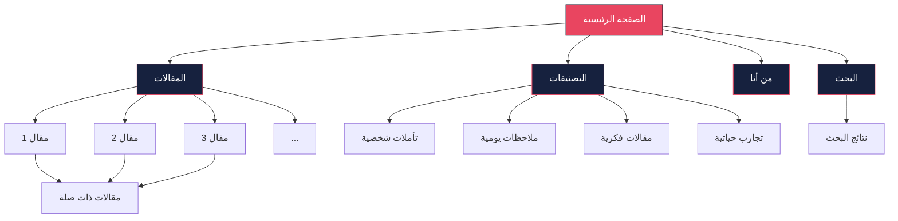

# 🗺️ خريطة الموقع (Sitemap)

## 📊 هيكل الموقع العام



## 📄 صفحات الموقع

### 1. الصفحة الرئيسية (`index.html`)
**الرابط**: `/`  
**الوصف**: الصفحة الرئيسية التي تعرض أحدث المقالات والإحصائيات  
**المحتوى**:
- شريط التنقل
- قسم الترحيب
- إحصائيات سريعة
- أحدث المقالات (3-5 مقالات)
- رابط للفهرس الكامل
- تذييل الصفحة

### 2. صفحة المقال (`articles/[article-id].html`)
**الرابط**: `/articles/article-1.html`  
**الوصف**: صفحة عرض مقال واحد  
**المحتوى**:
- شريط تقدم القراءة
- عنوان المقال
- تاريخ النشر ووقت القراءة
- التصنيفات
- محتوى المقال
- أدوات القراءة
- مقالات ذات صلة
- أزرار المشاركة

### 3. صفحة الفهرس (`archive.html`)
**الرابط**: `/archive.html`  
**الوصف**: قائمة جميع المقالات  
**المحتوى**:
- شريط البحث
- فلتر التصنيفات
- قائمة المقالات
- ترتيب حسب التاريخ
- ترقيم الصفحات

### 4. صفحة التصنيفات (`categories.html`)
**الرابط**: `/categories.html`  
**الوصف**: عرض جميع التصنيفات  
**المحتوى**:
- قائمة التصنيفات
- عدد المقالات في كل تصنيف
- رابط لكل تصنيف

### 5. صفحة تصنيف محدد (`categories/[category].html`)
**الرابط**: `/categories/thoughts.html`  
**الوصف**: عرض مقالات تصنيف معين  
**المحتوى**:
- عنوان التصنيف
- وصف التصنيف
- قائمة المقالات في هذا التصنيف

### 6. صفحة من أنا (`about.html`)
**الرابط**: `/about.html`  
**الوصف**: نبذة عن صاحب الموقع  
**المحتوى**:
- صورة شخصية
- نبذة تعريفية
- روابط التواصل الاجتماعي
- إحصائيات شخصية

### 7. صفحة البحث (`search.html`)
**الرابط**: `/search.html`  
**الوصف**: صفحة البحث المتقدم  
**المحتوى**:
- شريط البحث
- خيارات البحث
- نتائج البحث
- اقتراحات

## 🔗 روابط التنقل

### القائمة الرئيسية
```
الرئيسية → /
المقالات → /archive.html
التصنيفات → /categories.html
من أنا → /about.html
```

### روابط التذييل
```
الرئيسية → /
المقالات → /archive.html
التصنيفات → /categories.html
من أنا → /about.html
تواصل معي → /about.html#contact
```

### روابط داخل المقالات
```
التصنيف → /categories/[category].html
مقالات ذات صلة → /articles/[related-article].html
مشاركة → (روابط خارجية)
```

## 📁 هيكل المجلدات

```
my-blog/
├── index.html                    # الصفحة الرئيسية
├── archive.html                  # صفحة الفهرس
├── categories.html               # صفحة التصنيفات
├── about.html                    # صفحة من أنا
├── search.html                   # صفحة البحث
│
├── articles/                     # مجلد المقالات
│   ├── article-1.html
│   ├── article-2.html
│   ├── article-3.html
│   └── ...
│
├── categories/                   # مجلد التصنيفات
│   ├── thoughts.html             # تأملات شخصية
│   ├── notes.html                # ملاحظات يومية
│   ├── essays.html               # مقالات فكرية
│   ├── experiences.html          # تجارب حياتية
│   └── tips.html                 # نصائح وإرشادات
│
├── assets/                       # الملفات الثابتة
│   ├── css/
│   │   ├── style.css             # التنسيق الرئيسي
│   │   ├── dark-theme.css        # تنسيق الوضع الداكن
│   │   └── responsive.css        # التصميم المتجاوب
│   │
│   ├── js/
│   │   ├── main.js               # JavaScript الرئيسي
│   │   ├── search.js             # وظائف البحث
│   │   ├── reading.js            # ميزات القراءة
│   │   └── storage.js            # التخزين المحلي
│   │
│   └── images/
│       ├── logo.svg              # شعار الموقع
│       ├── avatar.jpg            # الصورة الشخصية
│       ├── articles/             # صور المقالات
│       └── icons/                # الأيقونات
│
├── data/                         # البيانات
│   ├── articles.json             # فهرس المقالات
│   ├── categories.json           # التصنيفات
│   └── site-config.json          # إعدادات الموقع
│
├── _config.yml                   # إعدادات GitHub Pages
├── robots.txt                    # ملف الروبوتات
├── sitemap.xml                   # خريطة الموقع
└── README.md                     # وصف المشروع
```

## 🔍 خريطة SEO

### الصفحات المهمة للـ SEO
1. **الصفحة الرئيسية** - أهم صفحة
2. **صفحة الفهرس** - جميع المقالات
3. **صفحات المقالات** - المحتوى الرئيسي
4. **صفحات التصنيفات** - تنظيم المحتوى

### العناوين والوصف
```html
<!-- الصفحة الرئيسية -->
<title>مدونتي الشخصية | اقرأ، تأمل، تعلم</title>
<meta name="description" content="مدونة شخصية لنشر المقالات والمذكرات. اقرأ مقالات متنوعة في التأملات والملاحظات والتجارب الحياتية.">

<!-- صفحة المقال -->
<title>عنوان المقال | مدونتي الشخصية</title>
<meta name="description" content="مقتطف من المقال...">

<!-- صفحة التصنيف -->
<title>تصنيف | مدونتي الشخصية</title>
<meta name="description" content="مقالات في تصنيف معين...">
```

## 📱 روابط المشاركة

### مشاركة المقال
```javascript
// روابط المشاركة
const shareLinks = {
  twitter: `https://twitter.com/intent/tweet?text=${title}&url=${url}`,
  facebook: `https://www.facebook.com/sharer/sharer.php?u=${url}`,
  linkedin: `https://www.linkedin.com/shareArticle?mini=true&url=${url}&title=${title}`,
  whatsapp: `https://wa.me/?text=${title} ${url}`,
  telegram: `https://t.me/share/url?url=${url}&text=${title}`,
  email: `mailto:?subject=${title}&body=${url}`
};
```

## 🎯 روابط داخلية مهمة

### روابط التنقل الرئيسية
- `/` - الصفحة الرئيسية
- `/archive.html` - جميع المقالات
- `/categories.html` - التصنيفات
- `/about.html` - من أنا

### روابط المقالات
- `/articles/[id].html` - المقال
- `/categories/[category].html` - التصنيف
- `/articles/[related-id].html` - مقال ذو صلة

### روابط التذييل
- `/` - الرئيسية
- `/archive.html` - المقالات
- `/categories.html` - التصنيفات
- `/about.html` - من أنا
- `/about.html#contact` - تواصل معي

## 📊 إحصائيات الروابط

### الروابط الداخلية
- الصفحة الرئيسية: 5 روابط
- صفحة المقال: 8-10 روابط
- صفحة الفهرس: 15-20 رابط
- صفحة التصنيفات: 5-10 روابط

### الروابط الخارجية
- مشاركة المقال: 6 روابط
- التواصل الاجتماعي: 3-5 روابط
- المصادر: حسب الحاجة

## 🔄 تحديث الروابط

### عند إضافة مقال جديد
1. إضافة المقال في مجلد `articles/`
2. تحديث `articles.json`
3. تحديث الصفحة الرئيسية
4. تحديث صفحة الفهرس
5. تحديث صفحة التصنيف

### عند إضافة تصنيف جديد
1. إنشاء صفحة التصنيف في `categories/`
2. تحديث `categories.json`
3. تحديث صفحة التصنيفات
4. تحديث القائمة

---

**ملاحظة**: هذه الخريطة تساعد في تنظيم الموقع وتحسين تجربة المستخدم وSEO.
